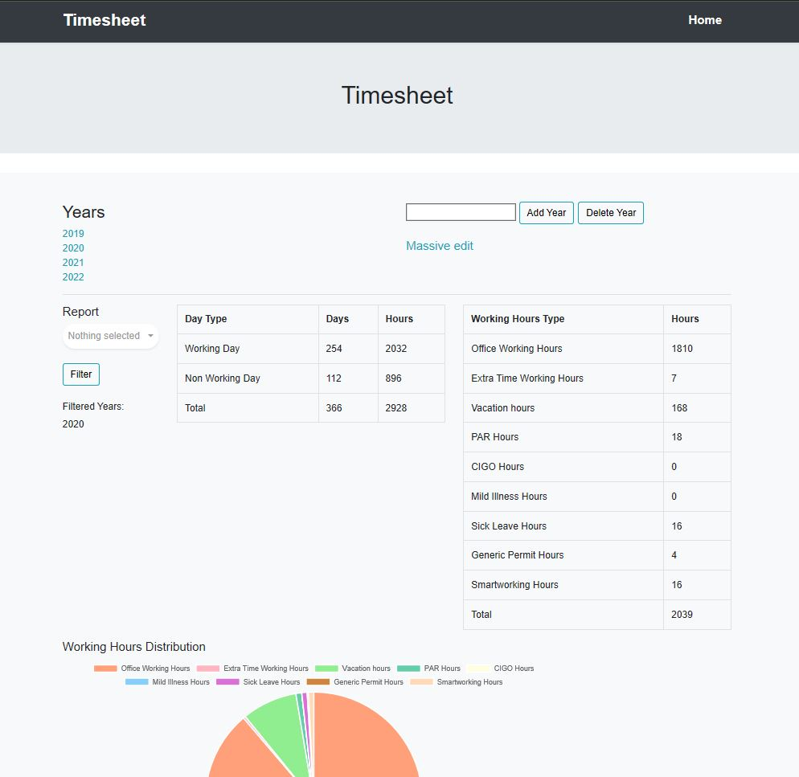
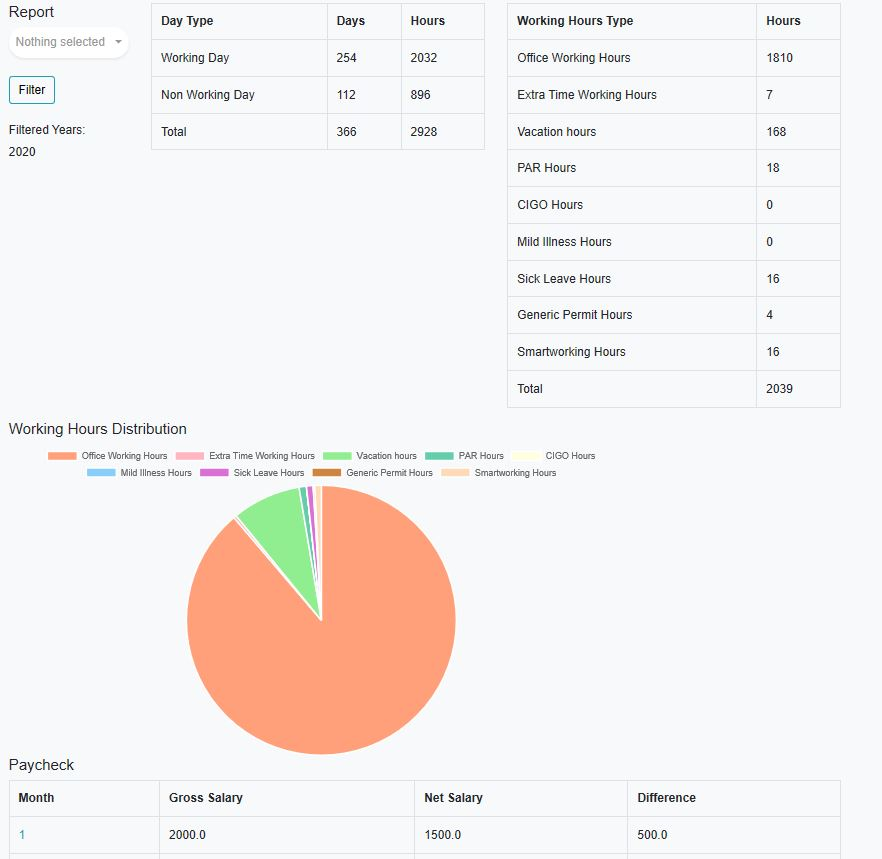
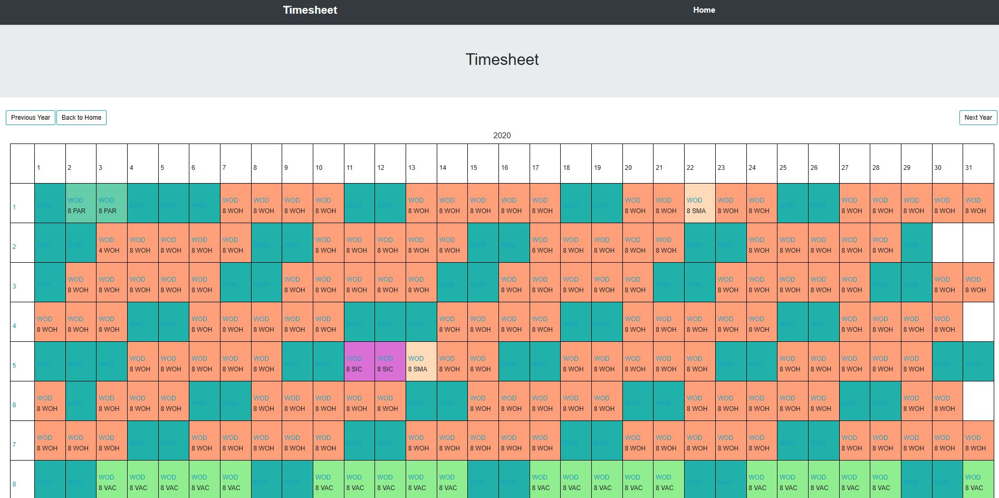
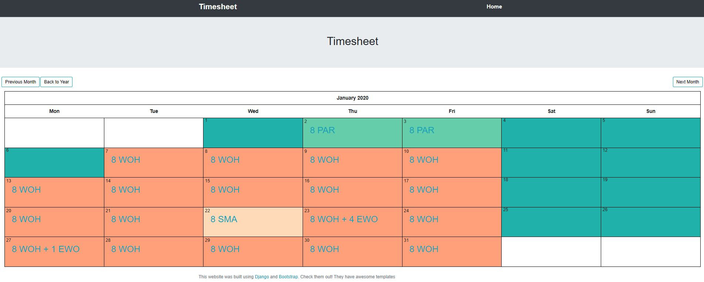

# Timesheet

## Introduction

Timesheet management Django application. The idea is to a have a single app to manage the working hours, plan vacations and keep track of the paycheks. The motivation for this project came from tha fact I just wanted to get rid of a bunch of Excel spreadsheets I was to do this tasks

The current configuration is suited for my needs regarding the types of working hours are provided by the Italian legislation e.g. [CIGO](https://it.wikipedia.org/wiki/Cassa_integrazione_guadagni), PAR, [Vacation](https://it.wikipedia.org/wiki/Ferie) ecc.

Day Types:
* Working Day - WOD
* Non Working Day - NWD

Hours Type:
* Office Working Hours - WOH
* Extra Working Hours - EWO
* Vacation Hours - VAC
* PAR Hours - PAR
* CIGO Hours - CIG
* Mild Illness Hours - IND
* Sick Leave Hours - SIC
* Generic Permit Hours - GPH
* Smartworking Hours - SMA

Monthly Paycheck 

Some dummy data is present in the database `db.sqlite3` that can be used as reference

## Software and Libraries

This project uses Python 3.8.2 and the following libraries:
* [Django](https://www.djangoproject.com/)
* [holidays](https://pypi.org/project/holidays/)

The calendar views are based on this awesome [post](https://www.huiwenteo.com/normal/2018/07/24/django-calendar.html) from [www.huiwenteo.com](www.huiwenteo.com)

The dropdown is from this [post](https://bootstrapious.com/p/bootstrap-multiselect-dropdown) from [https://bootstrapious.com](https://bootstrapious.com)

## Running the code

To run the application `python manage.py runserver`. The default url to connect to it is http://127.0.0.1:8000/

## Results

The django application 

In the home we have a list of already created Years and we can also Add or Delete a new Year. We can also use a massive edit feature

In the Report section we can select the Years we want to consider and have a summuary of the Day Type, Working Hours Type and Paychecks

When selecting an Year we ha a detailed view of the year in which we can change the Day Type for a given day

When selecting a Month we have a detailed calendar view in which we can change the composition of the Working Day

## Licensing and Acknowledgements

Thank you
